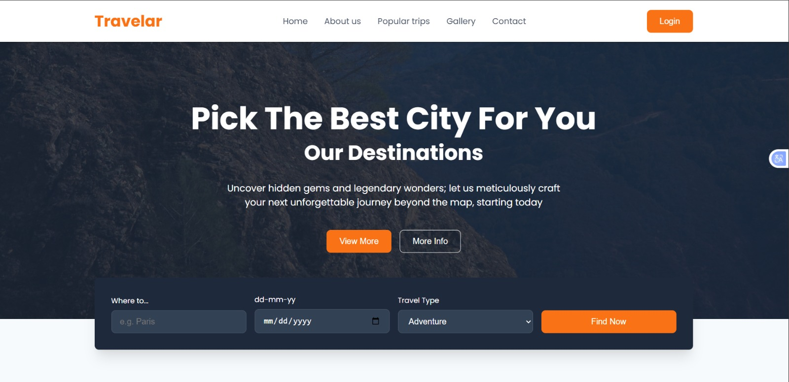
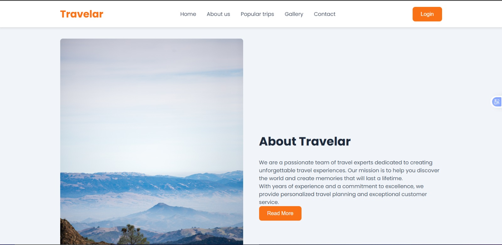
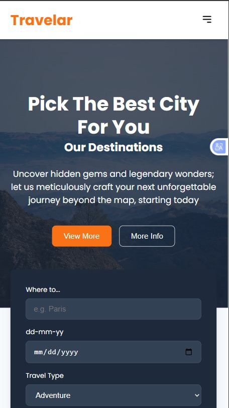
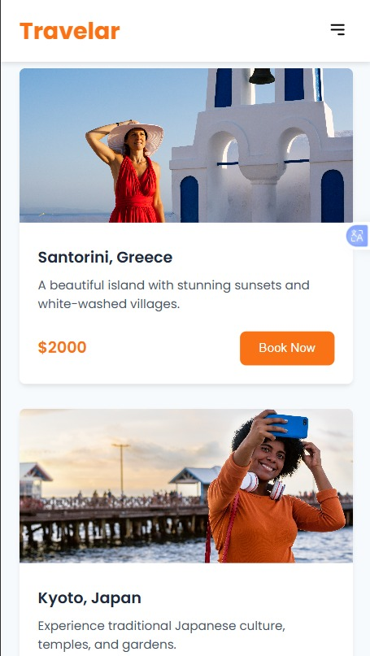

# Travel Agency Website

## Overview
A responsive website for a travel agency designed to showcase destinations, services, and travel packages in an engaging and user-friendly way.

## Problem It Solves
Travel businesses need an online presence to:
- Attract customers
- Showcase services
- Provide easy navigation for bookings and inquiries

This project demonstrates how a clean UI can improve user engagement.

## Features
- Responsive design
- Attractive layout for showcasing destinations
- Clear navigation structure

## Problems I Solved
- Improved layout responsiveness across devices
- Organized content for better user flow
- Designed sections to highlight key services effectively

## Preview

## Technologies Used
- HTML
- CSS

## How to Use
1. Open the website
2. Browse destinations and services
3. Navigate through different sections
4. Make enquires 
5. Book Travelling packages

## Future Improvements
- Add booking functionality
- Integrate backend services
- Improve animations and interactivity

## Lessons Learned
- Designing for user engagement
- Structuring content for business needs
- Improving responsiveness

## Live Demo
[View Live Project](https://amarachi-victoria.github.io/Travel-Agency-Website/)
